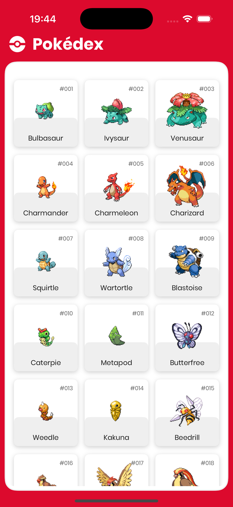
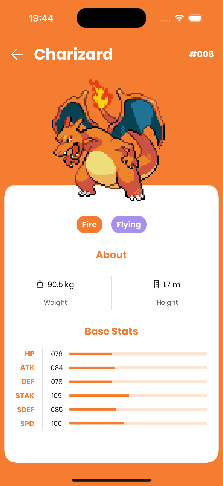
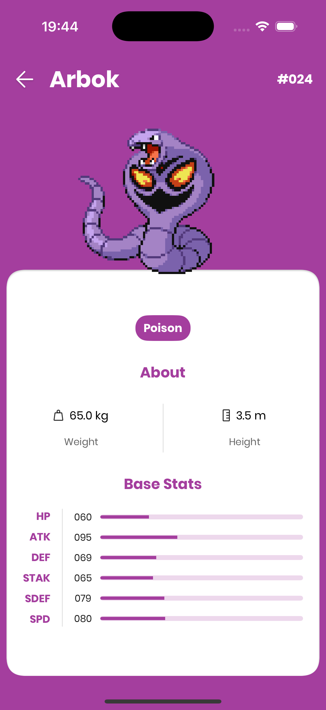

# 👾 Pokédex

A Pokémon encyclopedia iOS app with API integration, custom UI, and detailed stats.

## 🚀 Features

- **Browse List:** Scrollable, paginated list.
- **Detailed Views:** View stats, types, height, weight, and base stats for each Pokémon.
- **Pagination:**  Efficient data loading using paginated requests.

## 📱 Screenshots

     
 
## 🛠 Tech Stack

- **Language:** Swift  
- **UI Framework:** SwiftUI & UIKit
- **Architecture:** MVVM-C
- **Concurrency:** Async/Await & Task Groups
- **Networking:** URLSession
- **API:** [PokéAPI](https://pokeapi.co/).
 
